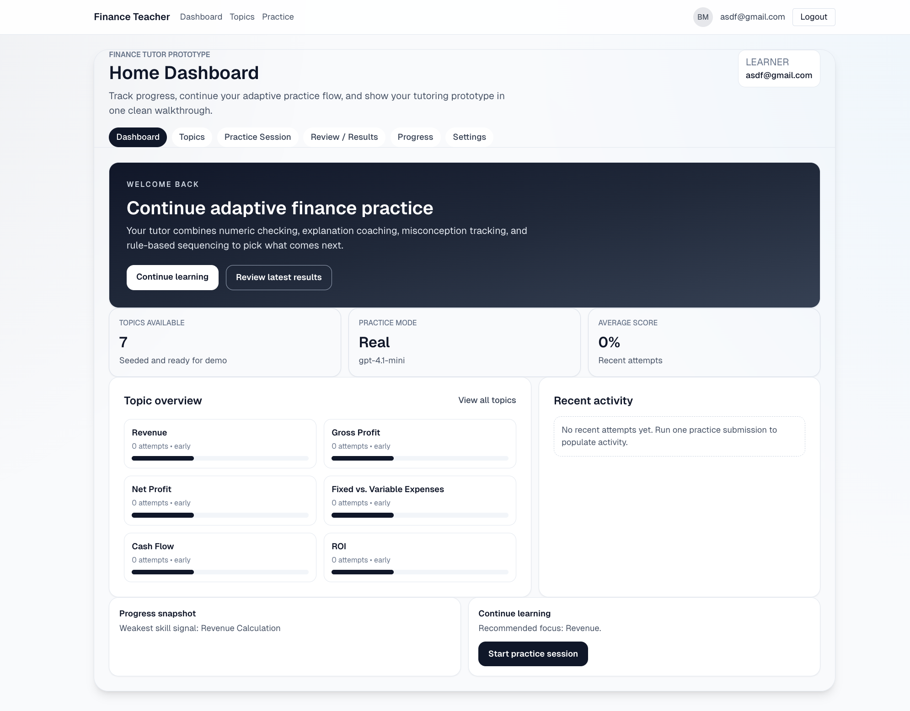
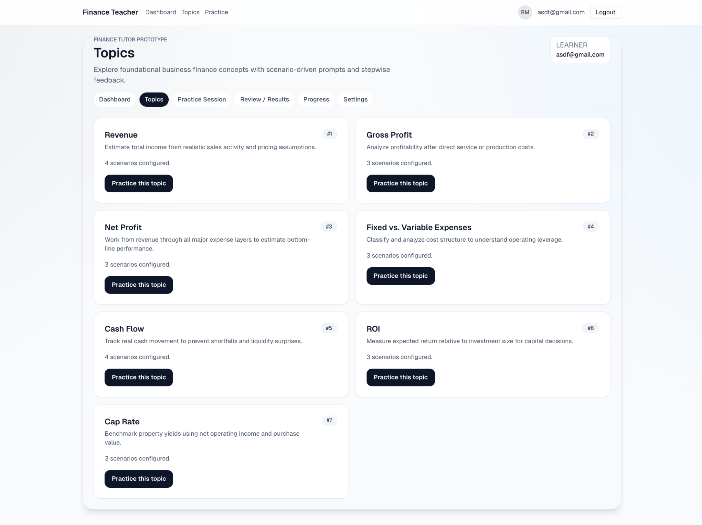
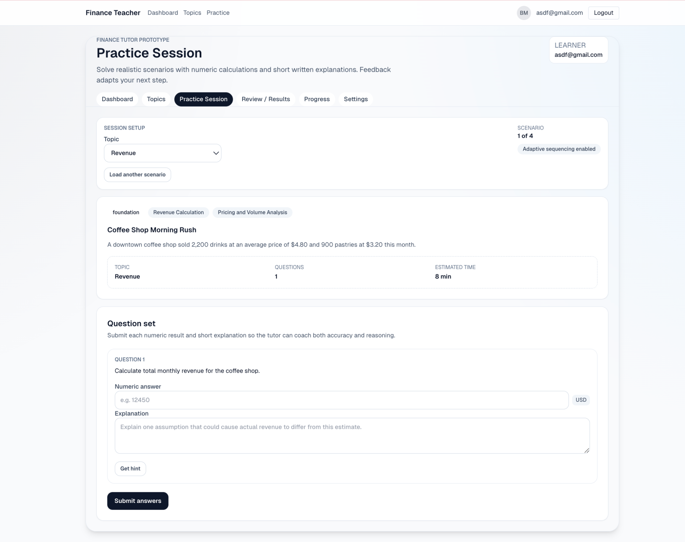
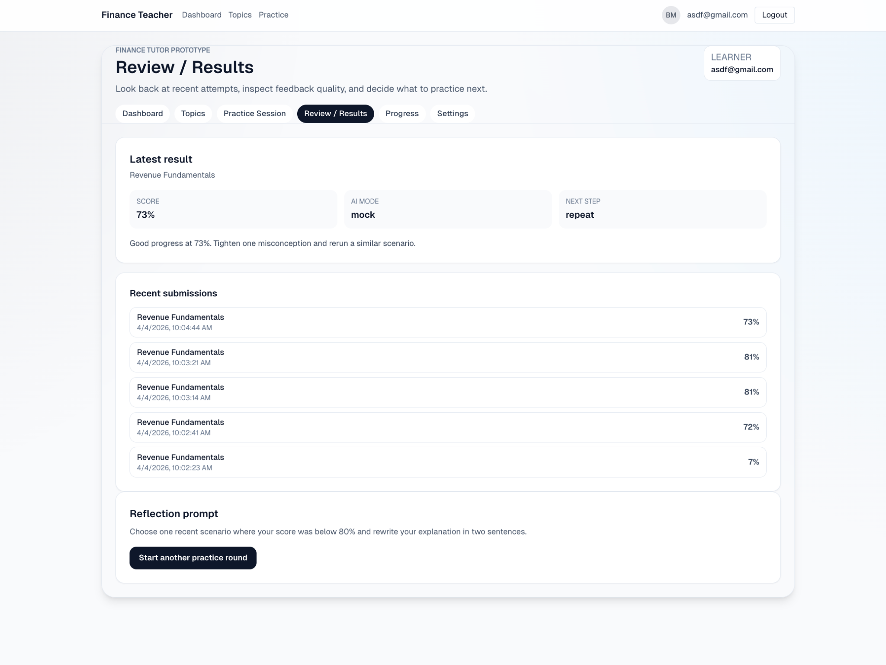
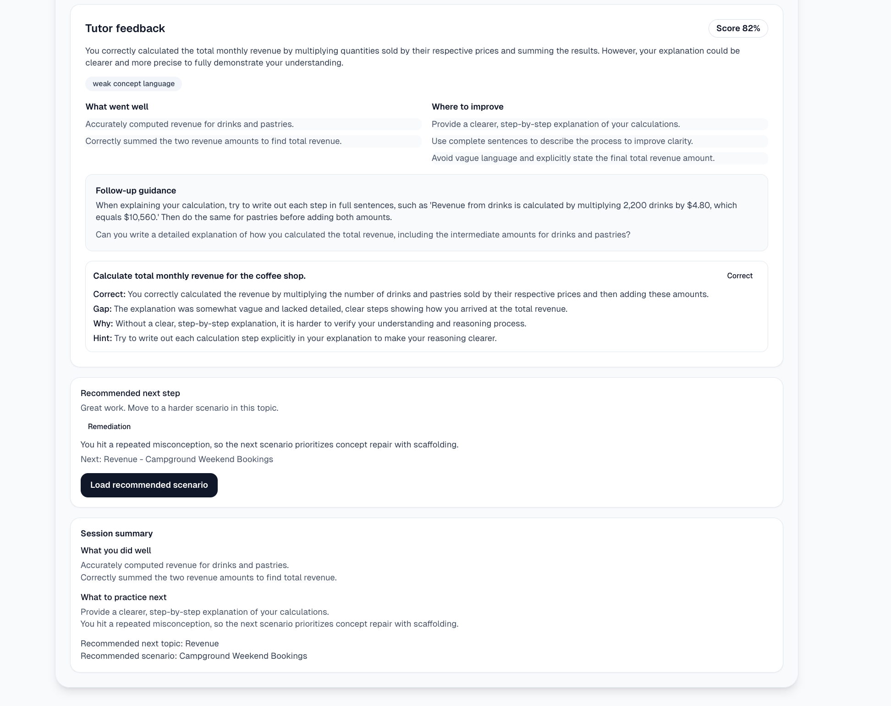
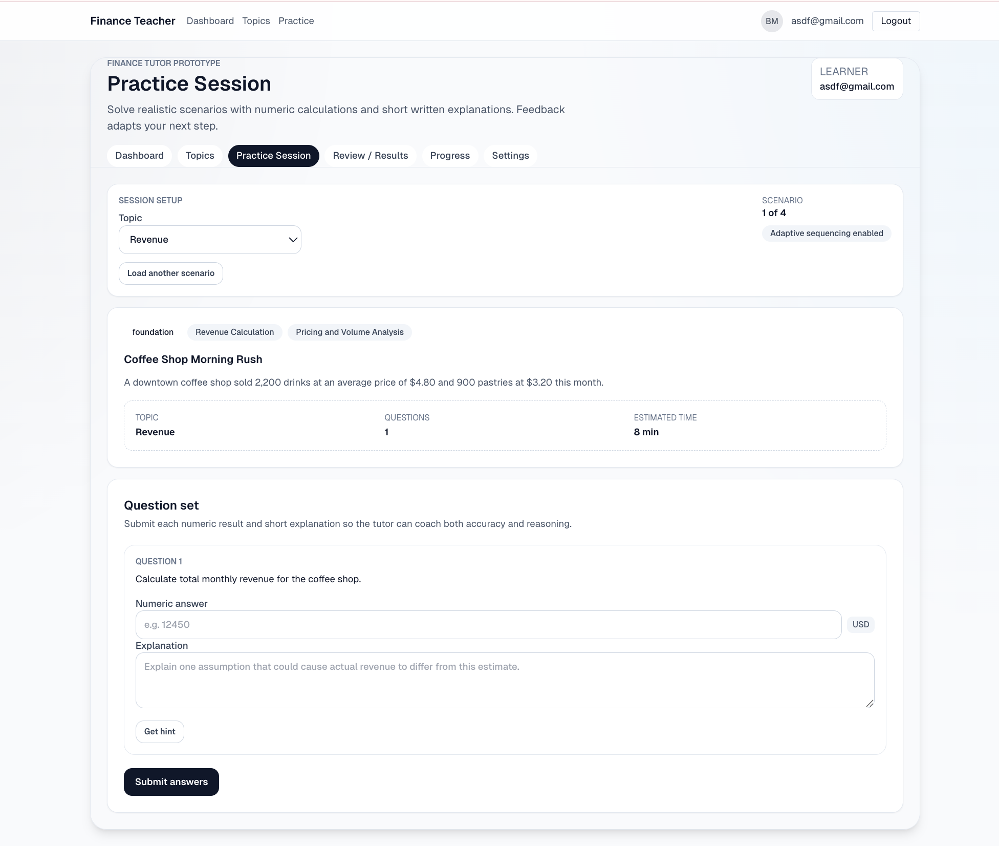
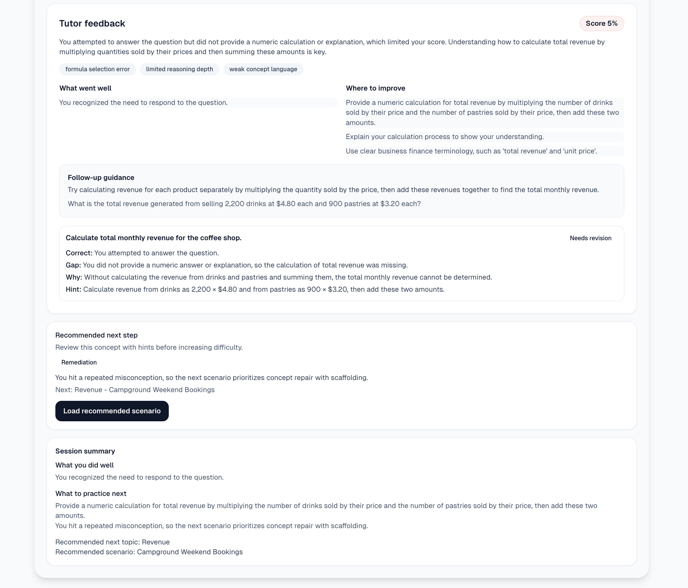

# Finance Teacher: An AI-Supported Tutor for Introductory Financial Analysis

**CS 5620 – AI in Education**  
**Date:** April 20, 2026  
**Instructor:** Dr. Seth Poulsen  
**Student:** Brock McDermott  

## Abstract

This project looks at how artificial intelligence can be used to support learning in an introductory finance setting through a prototype called **Finance Teacher**. I designed the system to help learners practice and better understand core financial analysis concepts such as net operating income (NOI), return on investment (ROI), and capitalization rate instead of only memorizing formulas. The main issue behind the project is that many students can plug numbers into a formula and get an answer, but they still struggle to explain what the metric means, when it should be used, and how it should affect a real decision. That gap matters in finance because students are expected to do more than calculate. They also need to interpret results and connect them to value, risk, and performance. Research in the learning sciences, intelligent tutoring systems, and formative feedback suggests that students learn better when they get timely, specific feedback and when instruction builds on prior knowledge instead of only delivering static content. At the same time, work on generative AI shows that large language models can be useful for explanation and tutoring, but they also introduce risks such as hallucination, overconfidence, and shallow reasoning. This report explains the problem I wanted to address, the research that shaped the design, how I applied AI in the prototype, what the project showed, and what I would improve next. My main conclusion is that AI can be useful as a feedback and explanation tool in finance education, but it works best when it is tightly focused, carefully structured, and treated as support rather than authority.

## Problem

The problem this project addresses is the gap between **doing finance calculations** and **actually understanding finance concepts**. In introductory real estate or investment finance, students are often taught formulas for NOI, cap rate, and ROI. They may be able to calculate those values correctly on a worksheet, but that does not always mean they understand what the result tells them. A student might get the cap rate right, for example, and still not know whether it signals a strong opportunity, a risky investment, or something that depends entirely on context. In other words, getting the number right does not automatically mean the student understands the decision behind the number.

This problem connects closely to the learning sciences. Sawyer argues that deeper learning involves more than collecting facts and procedures. Students learn more effectively when they build conceptual understanding, connect new ideas to what they already know, and apply that knowledge in meaningful settings (Sawyer, 2014). That idea fits finance well. Finance is full of formulas, but finance learning should not stop at formulas. Students need to understand what a metric represents, why it matters, and how to use it in a realistic situation.

I chose this problem because financial literacy and financial analysis are both practical and transferable. A student who can reason through NOI, ROI, and cap rate is not only better prepared for schoolwork, but also better prepared for future business, investing, and personal finance decisions. Finance tasks are also a good fit for educational technology because they involve repeated practice, common mistakes, and a mix of numeric and conceptual reasoning. Research on intelligent tutoring systems has shown that computer-based tutors can improve learning when they provide immediate, targeted feedback and respond to how students think rather than only grading final answers (Anderson et al., 1995). VanLehn (2006) also explains that tutoring systems are especially valuable when they support the learner step by step through an “inner loop” of feedback, hints, and assessment instead of waiting until the end to say whether the student was right or wrong.

That idea shaped my thinking early in the project. I did not want Finance Teacher to be a tool that only checked answers. I wanted it to help students understand the relationship between the formula, the numbers, and the financial meaning behind the result. That made generative AI interesting for this project. A large language model can explain a concept in different ways, respond conversationally, generate worked examples, and adapt feedback to a learner’s response. At the same time, those strengths come with obvious risks. A model can sound convincing while still being wrong. It can also encourage students to depend on explanations without thinking for themselves. Because of that, this project was not just about “using ChatGPT for school.” It was about seeing whether AI could be shaped into a more intentional tutoring tool for finance learning.

### Research Questions

This report focuses on three research questions:

1. How can an AI-supported tutoring prototype be designed to help learners understand introductory finance metrics such as NOI, ROI, and cap rate?

2. What ideas from intelligent tutoring systems, formative feedback research, and the learning sciences are the most useful for a finance-learning tool?

3. What benefits and risks appear when generative AI is used as the explanation and feedback engine for a finance tutor?

## Background

The first part of the background comes from the learning sciences. Sawyer (2014) argues that good learning environments do not just deliver facts and procedures. They help students build deeper conceptual understanding, connect new ideas to prior knowledge, and reflect on their reasoning. That point matters in finance because finance instruction can easily become procedural. If students only memorize formulas, they may succeed on very narrow tasks while struggling when the numbers are presented differently or when the problem asks for interpretation instead of computation. From that perspective, a finance tutor should do more than answer checking. It should support explanation, revision, and reflection.

The broader artificial intelligence in education literature also helped frame the project. Luckin et al. (2016) describe AIEd as a field built around pedagogical models, domain models, and learner models. Their argument is that effective AI in education should adapt to learners and provide support that is more personalized, flexible, and engaging. That was useful for my project because students do not all struggle with finance in the same way. One student may need help understanding a formula. Another may need help interpreting an answer. Another may only need a short worked example. A static worksheet cannot do much with those differences, but an AI-supported tutor potentially can.

The intelligent tutoring systems literature was especially important. Anderson et al. (1995) showed that cognitive tutors can help students reach strong levels of proficiency when they provide immediate, directed feedback and are based on how students actually solve problems. VanLehn (2006) later described tutoring systems in terms of an outer loop and an inner loop. The outer loop selects tasks, while the inner loop responds to student actions with feedback, hints, and assessment. That distinction was helpful because it gave me a simple way to think about the prototype. In Finance Teacher, the outer loop is the flow of topics and problem types. The inner loop is the part where the learner enters an answer and the system responds with explanation, correction, or a hint.

Student modeling research also mattered. Pardos and Heffernan (2010) showed that individualized knowledge-tracing approaches can improve prediction by accounting for differences in prior knowledge. I did not build a full Bayesian student model into my prototype, but this research still shaped my thinking. I wanted the tutor to eventually respond differently depending on what a student already knew, where they were making mistakes, and how much support they needed. Even though the current version is still lightweight, the long-term goal is clearly moving toward stronger learner modeling.

Another major influence was research on feedback. Cavalcanti et al. (2021) found that automatic feedback in online learning environments often improves student performance and that there is limited evidence that manual feedback is always better than automatic feedback. That helped justify the basic direction of the project. If automated support can work well in other structured learning settings, finance is a reasonable place to try it because many finance tasks have defined targets, common misconceptions, and clear opportunities for explanation.

The broader literature on formative feedback supported the same idea. Effective formative feedback is usually timely, specific, supportive, and aimed at helping the learner improve their thinking instead of only labeling an answer as wrong. That idea shaped Finance Teacher directly. A useful finance tutor should not just say “incorrect.” It should explain whether the learner chose the wrong formula, misunderstood an input, or misread the financial meaning of the output.

Recent work on generative AI added both promise and caution. Prather et al. (2024) found that generative AI tools in computing education are often useful for hints, explanations, and learning resources, especially when the tools include guidance or instructor-provided guardrails. Even though their work is in computing education, the design lesson still transfers well to finance. Open-ended AI tools can be useful, but they are usually more educationally effective when their use is constrained and purposeful.

At the same time, Bender et al. (2021) warn that large language models can introduce serious risks, including misinformation, bias, and the tendency for people to mistake fluency for understanding. That concern felt especially relevant for a finance tutor. If a system gives an explanation that sounds smart but is subtly wrong, a beginner may not catch the difference. That is one reason this project stayed focused on a small set of concepts instead of trying to become a general finance chatbot.

Finally, Pardos and Bhandari (2024) were especially relevant because they found that ChatGPT-generated help in mathematics produced learning gains that were statistically significant relative to a no-help control and not significantly different from human tutor-authored help. At the same time, the model still produced a noticeable number of low-quality hints before mitigation techniques were applied. That combination of usefulness and risk matched exactly what I kept seeing in this project. Generative AI is powerful enough to help, but not reliable enough to trust without structure and safeguards.

## Approach

Finance Teacher was designed as a prototype AI tutor for introductory financial analysis. The focus was on helping learners understand and apply concepts such as NOI, ROI, and cap rate. I was not trying to build a full commercial tutoring platform or something that could replace an instructor. The goal was more practical than that. I wanted to create a proof-of-concept system that could provide immediate explanations, guided practice, and corrective feedback in a part of finance where students often struggle to move past formula memorization.

### Learning Goals

The main learning goals for Finance Teacher were:

1. Help learners correctly calculate introductory finance metrics.
2. Help learners explain what those metrics mean in plain language.
3. Help learners recognize common mistakes, such as misclassifying expenses or misreading a result.
4. Help learners connect a numeric output to an actual financial judgment.

These goals came directly from the problem I wanted to solve. I did not want the tool to act like a glorified calculator. I wanted it to help students understand what the numbers were saying.

### Design Philosophy

The design was shaped by three main ideas from the literature.

First, feedback should be **timely and specific**. If a student is confused, the best moment to help is right when the confusion happens, not after the whole problem is already finished.

Second, support should be **focused on learner reasoning**. It is not enough to say an answer is wrong. The system should respond to what the learner seems to be misunderstanding.

Third, AI should be used with **guardrails**. Large language models are flexible, but they can also generate confident nonsense. Because of that, I kept the system narrow and explanation-oriented instead of making it a totally open chatbot.

### What I Actually Built

The prototype uses a large language model as the explanation and feedback layer. In simple terms, the model is prompted to do a small set of tutoring tasks instead of acting like a general assistant. Those tasks include:

- explaining a finance concept in simple language,
- walking through a calculation step by step,
- identifying likely mistakes in a learner response,
- comparing a learner’s reasoning to a correct approach,
- giving a hint before showing a full worked solution.

The actual flow of the tool is pretty simple. A student is given a finance problem, such as calculating NOI or interpreting a cap rate. The student enters an answer and, in some cases, a short explanation. The system then looks at that response and generates one of a few tutoring moves: confirmation, correction, a hint, or a worked example.

One thing I tried to do while designing the prompts was keep the AI from overdoing it. A common problem with LLM-based feedback is that it can become too long, too polished, and too eager to answer everything at once. For a student, that can be overwhelming. So the goal was to make the tool respond more like a tutor than like an essay generator. If the learner only needed a small nudge, the system should give a small nudge.

### Prototype Workflow

The intended workflow looks like this:

1. The learner selects or is given a finance topic or problem.
2. The system presents a problem involving a target concept such as NOI, cap rate, or ROI.
3. The learner enters an answer and sometimes a short written explanation.
4. The AI compares the learner’s response to the intended concept and reasoning.
5. The system returns one of several response types:
   - confirmation with a short explanation,
   - correction with targeted feedback,
   - a hint or partial scaffold,
   - or a full worked example if the learner seems stuck.
6. The learner then revises the answer or moves to the next problem.

This workflow fits what VanLehn (2006) describes as the tutoring “inner loop” because the system is reacting to the learner’s step rather than waiting until the end. That was one of the most useful ideas I borrowed from the tutoring literature.

### Why This Approach Fit the Problem

This approach fit the project well for two reasons. First, finance is structured enough that the AI can be directed toward specific concepts and reasoning patterns. Second, finance still involves interpretation, which means students benefit from conversational explanation and not just computation.

A traditional intelligent tutoring system with heavily authored rules would probably be more reliable, but it would also take much more time to build. That tradeoff matters. Barnes and Stamper (2010) and other tutoring researchers show why automatic hint generation is attractive in the first place: authoring individualized support is expensive. Using a large language model gave me a flexible way to explore tutoring behavior without having to hand-author every possible hint or explanation.

## Results

Because this project is a prototype, the results are best shown through the system that was actually built and how its parts work together. By the end of the project, I had a working multi-page tutoring prototype with database-backed finance topics, scenario-based practice, hint generation, AI-supported feedback, review tools, progress tracking, and AI configuration settings. Instead of only describing what an AI finance tutor might do, Finance Teacher now demonstrates a complete learner flow from selecting a topic to receiving feedback and being directed to the next practice step.

### Overall Prototype Structure

The system is organized around a simple tutoring loop. A learner starts on the dashboard, chooses a topic, opens a scenario-based practice session, submits a numeric answer and a short written explanation, receives feedback, reviews recent results, and then uses progress information to decide what to practice next. This design matters because one of the original goals of the project was to build something that checks both **accuracy** and **reasoning**. In the code, that shows up clearly in the practice and feedback flow: the interface collects both a number and a short explanation, then sends both to the server for evaluation and coaching.

The codebase also shows that the prototype is not just a front-end mockup. The practice page loads available topics and scenarios from the tutoring data layer, the feedback route evaluates submissions and stores attempt history, and the progress page reads persisted learner progress back out of the system. The README and data model documents show that the tutoring system is built around a normalized structure with domains, topics, skills, scenarios, questions, sessions, attempts, feedback history, and skill mastery records. In the seeded finance domain, the prototype currently includes 7 topics and a larger set of scenario content for demo use. That makes the prototype feel much closer to a real tutoring product than a single static demo page.

### Dashboard and Entry Point

**Figure 1. Home Dashboard of Finance Teacher**

The Home Dashboard is the starting point of the system. It gives the learner a quick view of the tutoring environment by showing the main navigation, a large “continue learning” panel, the number of topics available, the current practice mode, recent activity, a topic overview, and a progress snapshot. In the screenshot, the dashboard shows that seven topics are available and that the tutor is operating in real mode with a configured model. It also highlights a weak skill signal and recommends a next practice focus.

This page is important because it communicates that Finance Teacher is not just a calculator or quiz page. It presents the system as an adaptive tutor with multiple layers: topic coverage, active practice, review, and progress monitoring. From a tutoring-systems perspective, this page acts like an outer-loop home base. It helps the learner see what exists in the system and where to go next rather than dropping them directly into a question without any context.

### Topic Catalog and Finance Coverage

**Figure 2. Topics page showing the available finance modules**

The Topics page shows the content structure of the prototype. In the current version, I built seven finance topics: Revenue, Gross Profit, Net Profit, Fixed vs. Variable Expenses, Cash Flow, ROI, and Cap Rate. Each topic card includes a short description of the concept, the number of scenarios configured for that topic, and a button to start practice. This design helps move the system away from isolated formula drills and toward a broader instructional structure.

One detail I intentionally built into this page is that the topics are described in business language rather than just mathematical language. For example, the ROI topic is framed around expected return relative to investment size, and the Cap Rate topic is framed around benchmarking property yields. That matters because one of the central problems behind the project was that students often learn formulas without fully connecting them to real financial interpretation. Even before a learner starts practice, the Topics page reinforces what each concept is for.

### Scenario-Based Practice Session

**Figure 3. Practice session screen before submission**

The Practice Session page is the core instructional screen in the prototype. The current screenshot shows a revenue scenario called **Coffee Shop Morning Rush**. The learner is given a short business context, the relevant topic tags, the estimated time, and a question prompt. They then enter a numeric answer and a short written explanation. The interface also includes a “Get hint” button and a submit button.

This page is where the system becomes more than a worksheet. The learner is not only asked to compute the total monthly revenue. They are also asked to explain an assumption that could cause actual revenue to differ from the estimate. That second prompt is a direct response to the main learning goal of the project. I did not want the tutor to check only the final number. I wanted it to push learners to explain what they were doing and show whether they understood the business meaning behind the calculation.

In the code, this practice screen is backed by the `PracticeSessionWorkspace` component. It loads topics and scenarios from the tutoring data layer, lets the learner switch topics, cycles through scenarios, and keeps track of session state. When the learner asks for help, the page sends a request to `POST /api/tutoring/hint`, which returns a level-1 or level-2 hint for the specific question. When the learner submits, the page sends `topicSlug`, `scenarioId`, `sessionId`, and the full answer payload to `POST /api/tutoring/feedback`.

### How Submission and Feedback Actually Work

After submission, the server first validates the request and fetches the selected scenario and question content. It then runs a deterministic evaluation process before generating tutoring language. In the code, this happens inside `evaluatePracticeSubmission`. Numeric answers and explanations are graded separately. The score combines the numeric portion and the explanation portion, with the numeric result weighted more heavily and the explanation still counting as a meaningful part of the submission. The evaluation also checks whether the response is fully correct and attaches misconception tags when patterns in the answer suggest issues such as shallow reasoning, missing calculations, or weak concept language.

Once the structured evaluation is done, the AI provider generates the coaching text. That includes the summary, strengths, improvements, question-level explanation, and follow-up guidance. Importantly, the codebase separates these responsibilities: deterministic logic handles numeric grading, explanation scoring, misconception tagging, and next-step logic, while the AI is used to generate more natural tutoring language. That separation makes the system stronger. It means the prototype is not relying on the language model to invent the grading logic from scratch.

The feedback route also persists learner data. After evaluating the attempt, the server creates attempt records, stores feedback history, updates learner progress, reads the learner’s skill mastery, and then runs the adaptive sequencing engine. That engine selects a next recommendation such as remediation, scaffold, reinforce, or advance depending on score level, repeated misconceptions, and current skill confidence. In other words, the system is not only giving feedback on one answer. It is also deciding what the learner should practice next.

### Low-Scoring Feedback Example

**Figure 4. Feedback for a weak or incomplete answer**

This screenshot shows what happens when the learner gives a weak response. In this example, the score is 5%. The tutor feedback explains that the learner responded to the question but did not provide the required numeric calculation or explanation. It tags the attempt with issues such as formula selection error, limited reasoning depth, and weak concept language. The screen then separates the response into “What went well” and “Where to improve,” gives follow-up guidance, and provides a specific hint about how to calculate revenue from drinks and pastries separately before combining them.

This is one of the strongest pieces of the prototype because it shows the tutor doing more than saying “wrong.” It identifies the gap, explains why that gap matters, and gives the learner a better path forward. The system also recommends the next step as remediation and explains that the next scenario will prioritize concept repair with scaffolding. That is exactly the kind of behavior I wanted when I started the project: a system that reacts to the learner’s misunderstanding instead of just marking the answer incorrect.

### Stronger Feedback Example

**Figure 5. Feedback for a stronger answer with reasoning improvement suggestions**

This second feedback screenshot shows the same basic tutoring structure on a stronger response. Here the score is 82%. The learner correctly calculated the total monthly revenue, so the system recognizes what was done well. At the same time, it still points out that the explanation could be clearer and more precise. The feedback asks for a more complete step-by-step explanation, recommends better terminology, and suggests explicitly stating the final total revenue amount.

This example is useful because it shows that the tutor is not binary. It does not treat learning as just right or wrong. A learner can be mostly correct and still receive coaching on communication, reasoning clarity, and business-finance language. That is important for this project because one of the main goals was to move beyond procedural correctness and toward deeper understanding. The higher-scoring example makes it clear that the system can reward correct math while still coaching students to explain their work better.

### Review and Reflection

**Figure 6. Review / Results page with recent submissions and reflection prompt**

The Review / Results page lets the learner look back across recent attempts. It shows the latest result, recent submission scores, and a reflection prompt that asks the learner to choose a lower-scoring scenario and rewrite their explanation. In the screenshot, the page displays a recent set of revenue attempts with varying scores and suggests repeating a scenario after identifying a misconception that still needs work.

This page matters because it turns the tutor into more than a one-question-at-a-time system. It gives the learner a way to reflect on patterns in their own work. That is a much better fit for the learning goals of the project than a simple score history alone. The reflection prompt especially matters because it asks the learner to revisit weak reasoning and improve it in writing, which pushes the system closer to metacognitive support rather than only answer checking.

### Progress and Mastery Tracking

**Figure 7. Progress page showing topic mastery and weak areas**

The Progress page gives a broader view of learner development across topics. It shows total attempts, average score, improving topics, topic mastery cards, and weak areas to review. Even though the current screenshot reflects early seeded data, the structure of the page is important. The prototype is designed to track mastery by topic and skill over time rather than only storing isolated scores.

This screen reflects the learner model direction of the project. The tutor is meant to build a picture of what the learner is strong in and what still needs work. The “weak areas to review” panel is especially important because it surfaces specific subskills such as revenue calculation, pricing and volume analysis, assumption analysis, and gross profit calculation. That gives the tutor a more concrete basis for recommending what should come next. In the codebase, this page is backed by persisted attempt history and `tutoring_skill_mastery`, which means the progress features are tied to stored learner data rather than being only visual decoration.

### Optional AI Configuration Evidence

**Figure 8. Settings page showing AI mode and tutoring preferences**

The Settings page is not the most important learning screen, but it is useful evidence for how the prototype is actually wired. It shows that the system distinguishes between mock and real AI modes, checks whether an OpenAI key is present, displays the configured model, and includes interface scaffolding for response style and difficulty ramp. The README also makes clear that the app supports mock mode for stable demos and real mode with fallback behavior if API problems occur.

I would include this screenshot only if I have room, but it does strengthen the report by showing that the AI layer is not just a vague idea. The prototype has a real configuration model behind it, and the project deliberately separates demo stability from real provider behavior.

### What the Results Show

Taken together, these screens show that Finance Teacher is a working tutoring prototype rather than just a proposal. The learner can move through a complete instructional cycle:

1. choose a finance topic,  
2. open a realistic scenario,  
3. submit both a number and a written explanation,  
4. receive structured feedback,  
5. review earlier attempts,  
6. reflect on weaker reasoning, and  
7. monitor progress over time.

The codebase also shows that this flow is backed by more than front-end design. The app loads topics and scenarios from a persistent data model, records attempts and feedback, updates learner progress, and uses an adaptive sequencing engine to choose what should come next. The most important result of the project, then, is not just that I built screens that look like a tutor. It is that I built a prototype that behaves like one. The system is not perfect, but it is a real step toward the kind of AI-supported finance tutor I set out to create.

### What the Project Showed

Looking back, the most useful design choices were:

1. focusing on conceptual understanding and not just answer correctness,
2. giving immediate, targeted feedback,
3. using hints before full worked solutions,
4. making the learner respond before the system explains,
5. planning for future student modeling even if the current version is still simple.

The project also showed that the benefits and risks of generative AI are tightly connected. The benefits are speed, flexibility, scalability, and the ability to give richer explanations than a static worksheet. The risks are hallucination, overconfidence, and the possibility of making learners passive if the system gives too much away. The main lesson I took from that is that AI works best here when it is treated like a carefully shaped support tool, not like an all-knowing tutor.

## Next Steps

If I were continuing this project, the first thing I would do is run a real user study. Right now, my claims are mainly about design feasibility and alignment with the literature. The next step should test whether students actually learn more effectively with Finance Teacher.

A reasonable study design would compare three conditions:

1. static worked examples,
2. the AI tutor,
3. and a no-help or minimal-help condition.

The study could measure pre/post conceptual understanding, problem-solving accuracy, time on task, explanation quality, and student confidence. That would let me test whether the AI tutor is actually improving understanding or whether it just feels more interactive.

The second major next step would be stronger validation and guardrails. I would want the system to check numeric outputs with deterministic calculations before showing explanations. I would also want prompts that force the model to stay closer to known finance structures instead of drifting into open-ended explanation. Self-consistency or multi-pass checking would also be worth exploring.

Third, I would want to add some real student modeling. Right now, the prototype can react to a response, but it does not maintain a strong learner model over time. A future version could track misconceptions, prior performance, and which kind of explanation a student benefits from most. That would move the tool closer to the model-based AIEd systems described by Luckin et al. (2016) and the student modeling research from Pardos and Heffernan (2010).

Fourth, I would improve the reflection side of the system. One idea I like is having students not only enter a number, but also explain what that number means. The tool could then respond to both the calculation and the interpretation. That would make the tutor much more aligned with the original problem I was trying to solve, which was the gap between doing the math and understanding the finance.

Finally, I think the long-term version of Finance Teacher should probably be a **teacher-support tool** more than a stand-alone tutor. The strongest use case is not replacing an instructor. It is giving students more individualized practice and giving the instructor better insight into where students are confused. That idea fits the broader AIEd literature well. The most realistic and useful future is teacher augmentation, not teacher replacement.

There are also some weaknesses I would need to watch carefully. The system can still over-explain. It can sound more personalized than it really is. It could also make students too dependent on conversational help if the activities are not designed carefully. Those are not reasons to abandon the project, but they are reasons to keep evaluating it honestly.

## Sharing Permissions / GitHub Link

I am okay with my work being shared.

GitHub link:  
https://github.com/brockmcdermott/FinanceTutor

## References

Anderson, J. R., Corbett, A. T., Koedinger, K. R., & Pelletier, R. (1995). *Cognitive tutors: Lessons learned*. *The Journal of the Learning Sciences, 4*(2), 167–207. JSTOR. https://www.jstor.org/stable/1466690

Barnes, T., & Stamper, J. (2010). *Automatic hint generation for logic proof tutoring using historical data*. *Educational Technology & Society, 13*(1), 3–12. JSTOR. https://www.jstor.org/stable/jeductechsoci.13.1.3

Bender, E. M., Gebru, T., McMillan-Major, A., & Shmitchell, S. (2021). *On the dangers of stochastic parrots: Can language models be too big?* In *Proceedings of the 2021 ACM Conference on Fairness, Accountability, and Transparency* (pp. 610–623). https://doi.org/10.1145/3442188.3445922

Cavalcanti, A. P., Barbosa, A., Carvalho, R., Freitas, F., Tsai, Y.-S., Gašević, D., & Mello, R. F. (2021). *Automatic feedback in online learning environments: A systematic literature review*. *Computers and Education: Artificial Intelligence, 2*, 100027. https://doi.org/10.1016/j.caeai.2021.100027

Conati, C., & Lallé, S. (2023). Student modeling in open-ended learning environments. In B. du Boulay et al. (Eds.), *Handbook of Artificial Intelligence in Education*. Edward Elgar.

Luckin, R., Holmes, W., Griffiths, M., & Forcier, L. B. (2016). *Intelligence unleashed: An argument for AI in education*. Pearson. http://creativecommons.org/licenses/by/4.0

Pardos, Z. A., & Bhandari, S. (2024). *ChatGPT-generated help produces learning gains equivalent to human tutor-authored help on mathematics skills*. *PLOS ONE, 19*(5), e0304013. https://doi.org/10.1371/journal.pone.0304013

Pardos, Z. A., & Heffernan, N. T. (2010). *Modeling individualization in a Bayesian networks implementation of knowledge tracing*. In *Proceedings of the 18th International Conference on User Modeling, Adaptation and Personalization* (pp. 255–266).

Prather, J., Leinonen, J., Kiesler, N., Benario, J. G., Lau, S., MacNeil, S., Norouzi, N., Opel, S., Pettit, V., Porter, L., Reeves, B. N., Savelka, J., Smith IV, D. H., Strickroth, S., & Zingaro, D. (2024). *Beyond the hype: A comprehensive review of current trends in generative AI research, teaching practices, and tools*. In *Proceedings of ITiCSE-WGR 2024*. ACM. https://doi.org/10.1145/3689187.3709614

Sawyer, R. K. (2014). The new science of learning. In *The Cambridge handbook of the learning sciences* (2nd ed.). Cambridge University Press. https://doi.org/10.1017/CBO9781139519526.002

VanLehn, K. (2006). *The behavior of tutoring systems*. *International Journal of Artificial Intelligence in Education, 16*, 227–265.